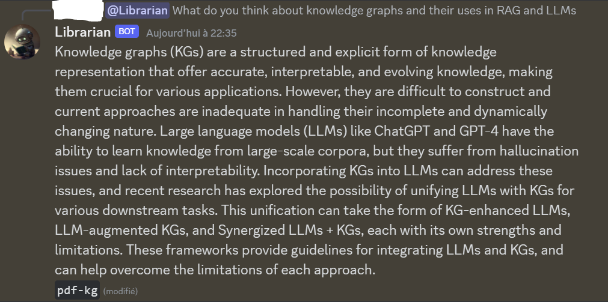

# Librarian
Originally a small personal project, I would like everyone to have fun and contribute to this small idea.  
The goal is simple, make a Discord Bot that has access to all files and information inside a discord server and answer the users questions.

## Explanations
To achieve this, we will require RAG, or Retrieval Augmented Generation.

For now, I'm using embeddings and vectors to compute the best documents and score them depending on the query of the user.  
Once the documents collected, we filter them depending on a score threshold, some pass, others don't, and those in between get summarized.

I will make some tools to open and read different kind of files ! Feel free to give ideas and make tools urself !

The LLM that answers is for now Mixtral, as I did not have a powerfull computer to run an LLM good enough, I'm using a free API from hugging face, you can insert your own access token !!

You can fork the project and work on ur own, make branches, make pull requests, or just tell me the idea and I will work on it !

## How to use
### Running
You first require an Access Token from HuggingFace.  
For that you create an account -> Settings -> Access Tokens.  
If you want to test it on your own, you need to create a discord bot on the [discord's developers portal](https://discord.com/developers/applications).  
Then you create a new application and bot. (Do not forget to toggle all intents !!)  
Once it's done, you can invite the bot to ur discord server:  
`https://discord.com/api/oauth2/authorize?client_id={bot_id}&permissions=0&scope=bot%20applications.commands`  
To run the code, you can just open the project on VSCode (or another IDE) and run bot.py, then you insert the Access token from Hugging Face and the Bot Token available on the developers portal.

### Commands
Once the bot is on, you must set the QA channel it will use to answer (he reacts with pings/mentions) and the info channels:  
`lib!set_qa #qa_channel #info_channel_1 #info_channel_2 ...`  
Then you load everything, a step where it will read all the documents available:  
`lib!load`  
You can now ask it anything !

### Notes
It will always take longer if it's the first time querying a document, modified document, or if there was a recent loading. After that, it will keep it on a cache for an exponentially quick access if the same document is requested a next time.  
I might add a command that makes it query all documents on loading, however, that will increase exponentially a lot more the time it takes for loading the documents.

## A small Demo of what it can do
It was provided with a PDF file about KG and LLMs among other channels with different documents.  
